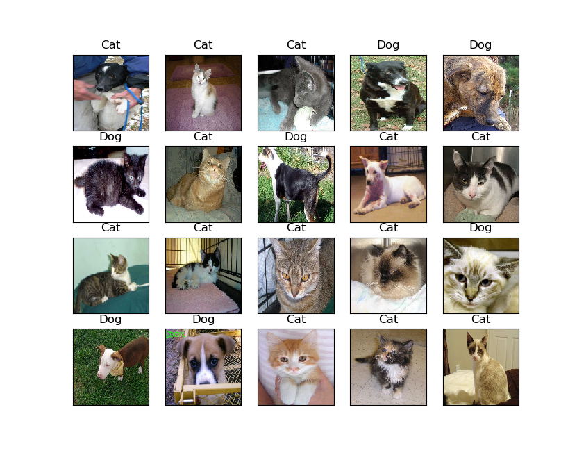

# Dogs_vs_Cats (Keras, Data Augmentation)

## Introduction
A basic Convolutional Neural Network (5-layer) is built to solve the problem using `Keras` (https://keras.io/) (a high level API for `TensorFlow`).
Concerning a small scale data-set problem, the project shows how to use data augmentation in `keras.preprocessing.image.ImageDataGenerator` class.

The function of each Python file is explained as follows:
1. **create_small_data_set.py** Create a small data-set for the project from the original data-set. In this project, 1000 images each class for training, 200 images each class for validation.
2. **training.py** Build and train the CNN image classifier. `ImageDataGenerator` class is used for generating batches of tensor image data with real-time data augmentation (https://keras.io/preprocessing/image/). `.flow_from_directory()` method is used to to generate batches of image data (and their labels) directly from the images in their respective folders, and the data will be looped over (in batches).
The training procedure is set to take 50 epochs (by default).The learning rate is set to 1e-4 (by default). The images size is set to 150×150 (by default) with RGB 3 channels.
3. **testing.py** load the trained classifier and get the predict result for the original test data-set.

Noted that even though we only have less than 10% of the full data-set, we got similar accuracy as the first approach.

## How to run the code
**Step 1: Environment setup**

Software/Module needed:
  * Python 3.6
  * NumPy(1.16.1)
  * Matplotlib
  * Tensorflow
  * keras      

**Step 2: Create the small data-set**

Run the `create_small_data_set.py` file. 

A small scale data-set will be copied from the original folders to the following folders (`small_data_set/train` and `small_data_set/validation`). Noted that the images of dogs and cats will be stored in separated sub-folders.

**Step 3: Train the CNN and save the model**

Run the `training.py` file. 

If you run this file in Command Prompt, you can add three argument parameter following the file name as the image size (type: int), the learning rate (type: float), and the epoch number (type: int). For example,`python training.py 100 0.001 10`. If you run the py file without argument, the parameters are set to their default value.

The CNN will be built and trained according to the data-set in the Step 2. When the training is finished, the training / validation accuracy and loss during the procedure will be shown as below:

When you close the figures, the trained model will be stored as a h5 file in the current folder.

**Step 4: Get the classification results of the testing data-set**

Run the `testing.py` file. 

If you run this file in Command Prompt, you can add three argument parameter following the file name as the image size (type: int), the learning rate (type: float), and the epoch number (type: int). For example,`python testing.py 100 0.001 10`. If you run the py file without argument, the parameters are set to their default value.

20 images from the testing data-set will be shown with the prediction result of the trained classifier, as shown below:

When the figure is closed, the `submission_file.csv` will be generated with the classification results (Dog '1' or Cat '0'') of all the images in the **../data/test/** folder.

