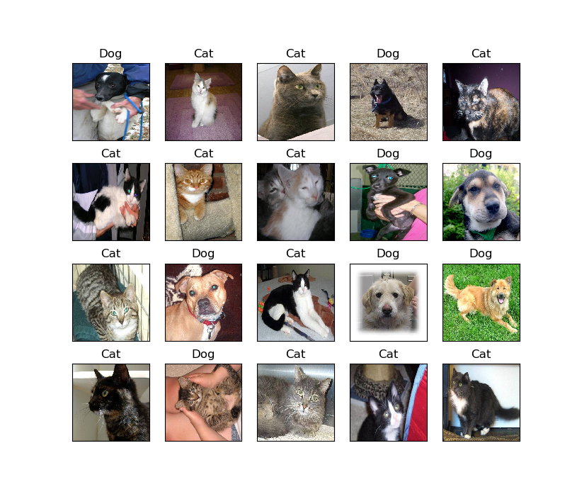

# Dogs_vs_Cats (Keras, Transfer Learning)

## Introduction
Transfer learning is used for improving the accuracy of the classifier. A pre-trained VGG16 network (https://keras.io/applications/#vgg16) is selected as the Convolutional base. The bottleneck features are extracted by running this Convolutional base on our training and validation data once and recording the output.
After that, a small fully-connected model on top of the stored features is built to train the classier. `Keras` API will also be used in the implementation.

The function of each Python file is explained as follows:
1. **create_small_data_set.py** Create a small data-set for the project from the original data-set. In this project, 1000 images each class for training, 200 images each class for validation, as well as 20 images for testing.
2. **get_features.py** Extract the bottleneck features of the pre-trained VGG16 network for both training and validation data-set. According to the requirement of VGG16, the images size is set to 224 ×224 with RGB 3 channels. The results will be stored in related .npy files.
3. **training.py** Build and train the CNN image classifier. The training procedure is set to take 50 epochs (by default).The learning rate is set to 1e-4 (by default). 
4. **testing.py** load the trained classifier and show the predict result for the small test data-set (20 images).

Noted that benefiting from the pre-trained VGG16 network, the training and validation accuracy of this classifier will be increased to both above 90%.

## How to run the code
**Step 1: Environment setup**

Software/Module needed:
  * Python 3.6
  * NumPy(1.16.1)
  * Matplotlib
  * Tensorflow
  * keras      

**Step 2: Create the small data-set**

Run the `create_small_data_set.py` file. 

A small scale data-set will be copied from the original folders to the following folders (`small_data_set/train`, `small_data_set/validation` ,`small_data_set/test`). Noted that the images of dogs and cats will be stored in separated sub-folders expect for the test data.

**Step 3: Extract the bottleneck features**

Run the `get_features.py` file. You will get four .npy files accordingly in the current folder.

**Step 4: Train the CNN and save the model**

Run the `training.py` file. 

If you run this file in Command Prompt, you can add three argument parameter following the file name as the learning rate (type: float) and the epoch number (type: int). For example,`python training.py 0.001 10`. If you run the py file without argument, the parameters are set to their default value.

The CNN will be built and trained according to the data-set in the Step 2. When the training is finished, the training / validation accuracy and loss during the procedure will be shown as below:

When you close the figures, the trained model will be stored as a h5 file in the current folder.

**Step 5: Show classification results of the selected test data-set**

Run the `testing.py` file. 

If you run this file in Command Prompt, you can add two argument parameter following the file name as the learning rate (type: float) and the epoch number (type: int). For example,`python testing.py 0.001 10`. If you run the py file without argument, the parameters are set to their default value.

20 images from the testing data-set will be shown with the prediction result of the trained classifier, as shown below:

