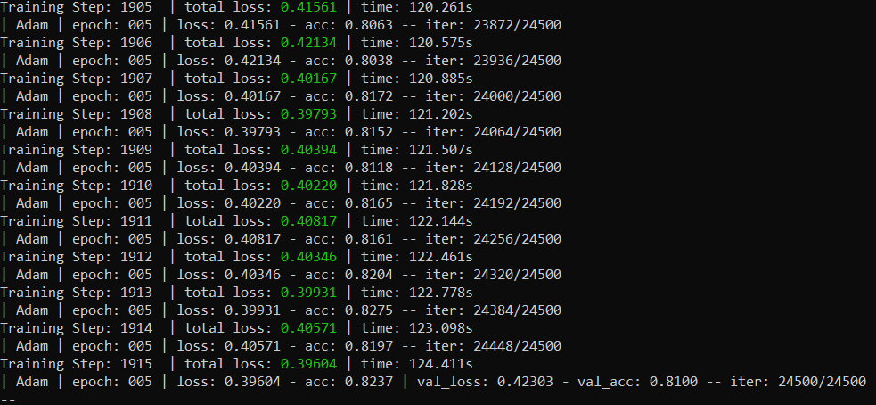
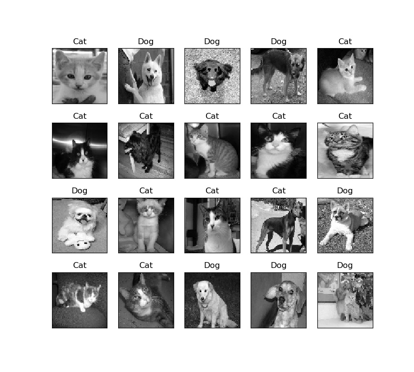
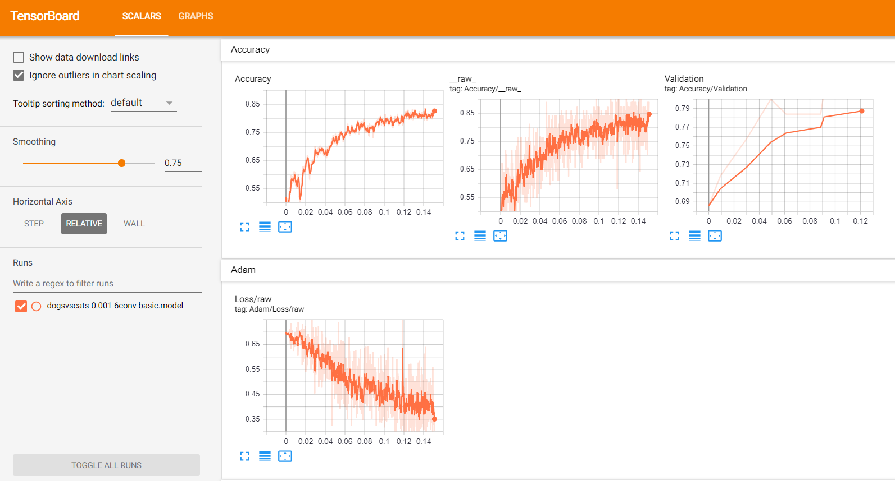

# Dogs_vs_Cats(TFLearn, basic 6-layer CNN)

## Introduction
The project is to implement a binary image classifier to tell a picture is Dog or Cat. The origin of this project is from a [Kaggle competition](https://www.kaggle.com/c/dogs-vs-cats) .
A basic Convolutional Neural Network (6-layer) is built to solve the problem using `TFlearn` (http://tflearn.org/) (a higher-level API for `TensorFlow`).

The function of each Python file is explained as follows:
1. **preprocessing.py** The program to pre-process the data-set, including the training data as well as the testing data. For decreasing the complexity of computation, each image is converted to the size of 80*80 (by default) and gray-scale. The images will be shuffled and stored in the related `npy` files. 
2. **cnn_model.py** The 6-layer CNN module implementation, in which the learning rate is set to 1e-3 (by default).
3. **training.py** The script to build, train and test the CNN image classifier. During the training procedure, 500 samples of the training data-set are assigned for validation. The training procedure is set to take 5 epochs(by default).
4. **get_image_classification_folder.py** Generate two separated folders and copy the images to these folders according to the classification results.

## How to run the code
**Step 1: Environment setup**

The project should be run using Python interpreter. It has been tested in PyCharm IDE as well as Command Prompt in Windows 10. 

Software/Module needed:
  * Python3
  * OpenCV
  * NumPy(1.16.1)
  * Matplotlib
  * Tensorflow
  * TFLearn   
  * tqdm
  
 Clone the files in this repository and unzip them in one folder.
    
**Step 2: Prepare the data-set**

The data-set can been obtained from [Kaggle](https://www.kaggle.com/c/dogs-vs-cats/data). 

Download the train.zip and test1.zip files, unzip them, and put the training data in (**./data/train/**) folder, and the testing data in the (**./data/test/**) folder.

**Step 3: Pre-process the data-set**

Run the `preprocessing.py` file. 

If you run this file in Command Prompt, you can add an argument parameter following the file name as the image size (type: int). For example,`python preprocessing.py 50`.

The training and testing data will be processed and stored into two files (`train_data.npy` and `train_data.npy`) in the current folder. 

**Step 4: Train the CNN and do the classification**

Run the `training.py` file. 

If you run this file in Command Prompt, you can add three argument parameter following the file name as the image size (type: int), the learning rate(type: float), and the epoch number (type: int). For example,`python training.py 50 0.001 10`.

The CNN will be built and trained according to the training data, as in the figure below:

When the training is finished, 20 images from the testing data-set will be shown with the prediction result of the trained classifier, as shown below:

When the figure is closed, the `submission_file.csv` will be generated with the classification results (Dog '1' or Cat '0'') of all the images in the **./data/test/** folder.

**Note:** if the CNN model has already been trained (e.g., `dogsvscats-6conv-basic-80-0.001-5.model` exits in the current folder), when you run this `training.py` file, the model will not be trained again, instead the trained model will be loaded.

**Step 5: Check the training progress using Tensorboard**
Launch your Command Prompt with \log dir which is located in your current folder, run command `tensorboard --logdir ./ --host=127.0.0.1`, then check out the tensorboard in your browser, as below:

**Step 6: Get the images within separated folders**
If you are satisfied with the result, run the `get_image_classification_folder.py` file. When the running is finished, you will get two folders (**./result/dogs/**, **./result/cats/**) with the images accordingly.

## Reference
https://www.geeksforgeeks.org/image-classifier-using-cnn/
